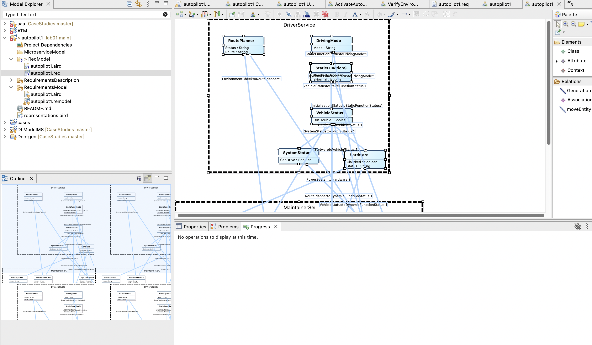
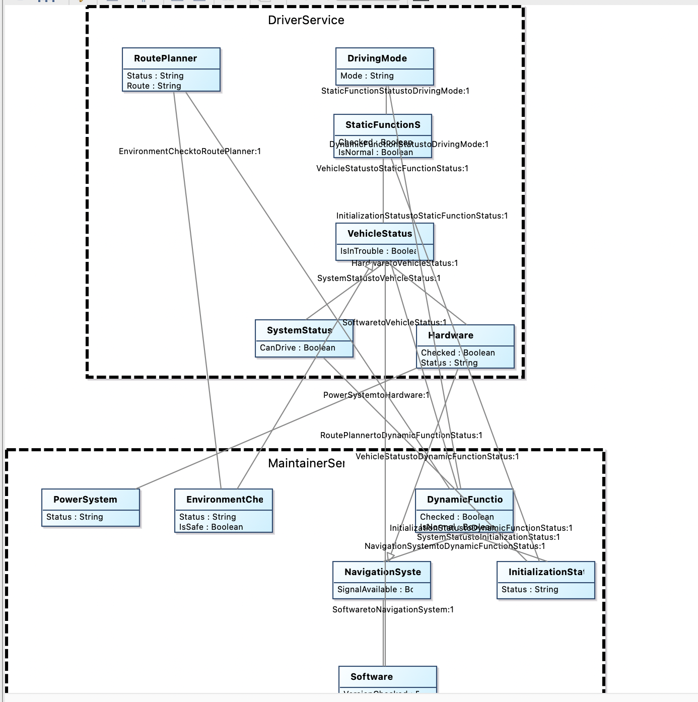
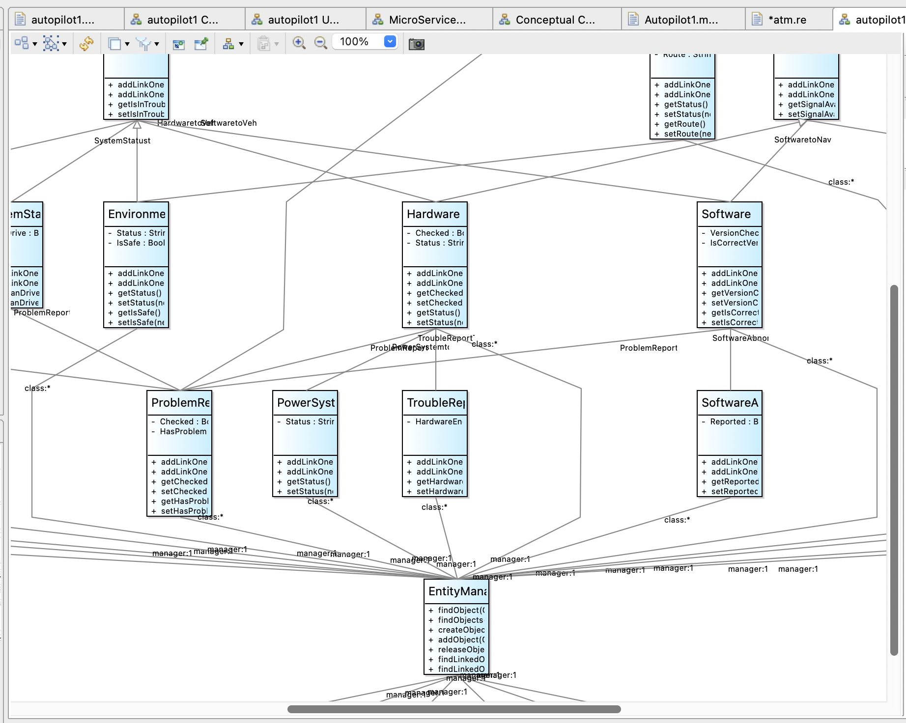

# lab01
lab01 

# lab02
## task1

## task2

好的！根据我们之前一起讨论的基于OCL和服务契约方法设计的自动驾驶控制系统的需求模型（你正在建模的服务包括 ActivateAutonomousDrivingModeService、VerifyEnvironmentalConditionsService、PerformSystemCheckupService，涉及实体如 PowerSystem、InitializationStatus、EnvironmentCheck、SystemStatus、DrivingMode 等），我可以为你用自然语言梳理出一套系统设计模型和相应的微服务架构设计。

⸻

✅ 一、设计模型（Design Model）——自然语言描述

本系统旨在提供一个可靠的自动驾驶控制流程，覆盖冷启动初始化、系统状态检查、环境评估、自动驾驶模式激活等关键步骤。

1. 核心功能模块

（1）系统检查模块（System Checkup Module）
	•	对车辆的核心系统（电源系统、传感器系统、控制模块等）进行全面状态扫描。
	•	判断是否存在关键异常，确保系统进入安全可控状态。

（2）环境感知模块（Environmental Evaluation Module）
	•	通过传感器评估当前环境是否适合自动驾驶（如光照、天气、路况）。
	•	提供一组环境状态指标用于决策。

（3）驾驶模式管理模块（Driving Mode Control Module）
	•	根据系统检查和环境感知结果判断是否允许进入自动驾驶模式。
	•	控制自动驾驶模式的激活和退出。

（4）初始化与异常恢复模块（Cold Start & Recovery Module）
	•	在车辆冷启动阶段完成初始化状态切换。
	•	若发现异常，尝试触发自恢复逻辑并重新评估系统状态。

2. 关键实体说明
	•	PowerSystem：表示电源系统的工作状态，如主电源是否正常。
	•	InitializationStatus：跟踪当前系统是否完成初始化。
	•	EnvironmentCheck：封装光照、温度、障碍物、道路信息等感知数据。
	•	SystemStatus：总体系统健康状况的评估结果。
	•	DrivingMode：车辆当前的驾驶模式（手动、半自动、全自动）。

⸻

✅ 二、微服务架构（Microservices Architecture）

本系统采用基于职责划分的微服务架构，每个微服务围绕特定业务能力进行设计，服务之间通过 API 协议通信，支持异步事件和状态通知。

🧩 微服务划分如下：

1. SystemCheckService
	•	责任：提供系统健康检查的服务，包括硬件与软件状态。
	•	输入：车辆启动信号、定时检查请求。
	•	输出：SystemStatus 对象。
	•	依赖实体：PowerSystem、传感器组件。

2. EnvironmentAssessmentService
	•	责任：评估当前驾驶环境是否安全。
	•	输入：来自传感器的数据流。
	•	输出：EnvironmentCheck 对象。
	•	功能扩展：可集成天气服务、地图 API 等。

3. InitializationService
	•	责任：在冷启动阶段完成一系列状态初始化任务。
	•	输出：InitializationStatus。
	•	可调度其他服务（如系统检查）作为启动前置条件。

4. DrivingModeService
	•	责任：根据各项指标切换或激活自动驾驶模式。
	•	输入：SystemStatus、EnvironmentCheck、InitializationStatus。
	•	输出：驾驶模式变更操作。
	•	保障机制：只在所有前置条件满足时允许激活。

5. RecoveryService
	•	责任：当系统出现异常时，提供诊断、通知和自恢复操作。
	•	可与 SystemCheckService 联动重试。
	•	输出：错误报告、恢复状态。

🔗 服务之间的调用与依赖关系（简化）：

InitializationService
     ↓
SystemCheckService  ←→ RecoveryService
     ↓
EnvironmentAssessmentService
     ↓
DrivingModeService

📦 数据存储与事件通信
	•	采用事件总线（如 Kafka、RabbitMQ）用于状态变更通知和日志追踪。
	•	每个服务维护独立的数据仓（CQRS 架构风格可选）。
	•	使用 OpenAPI / gRPC 定义服务接口，支持可视化建模。

⸻
